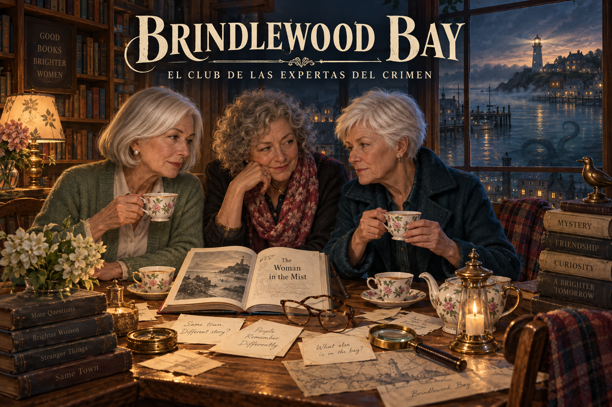
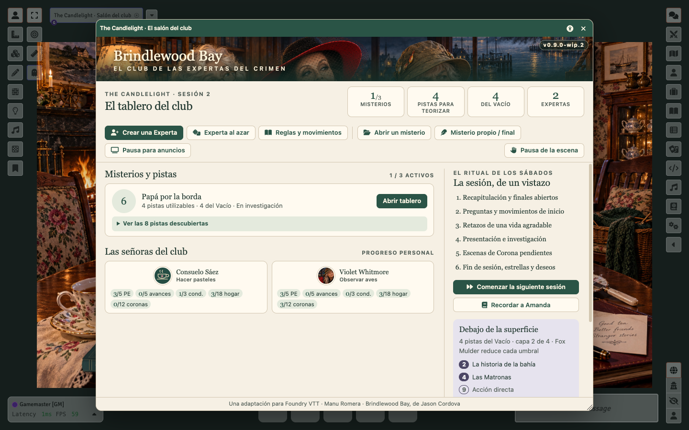
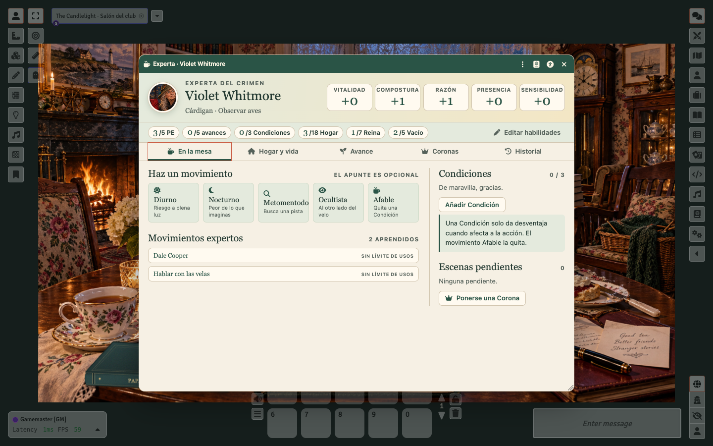
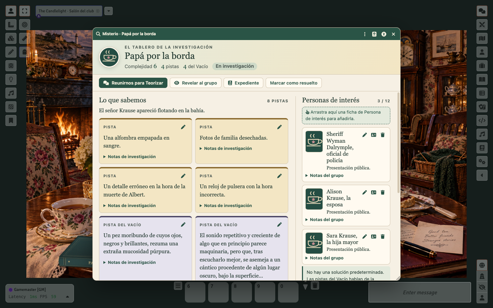
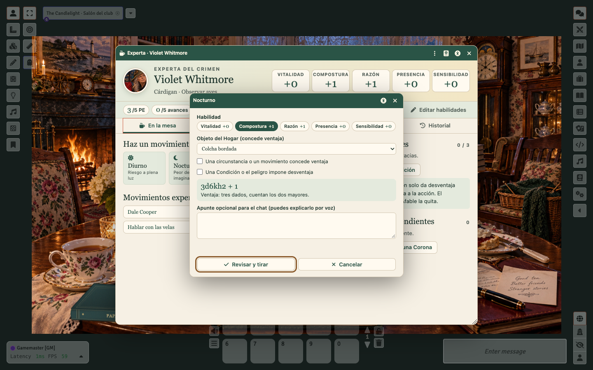
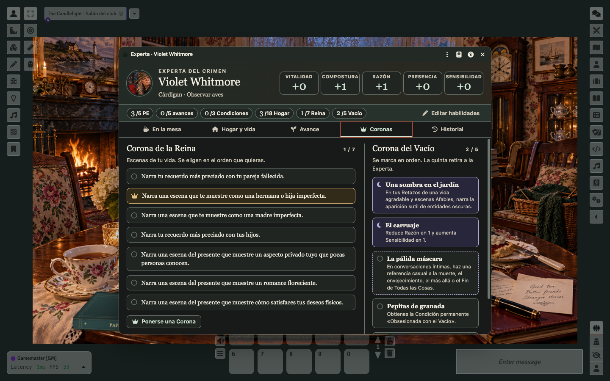
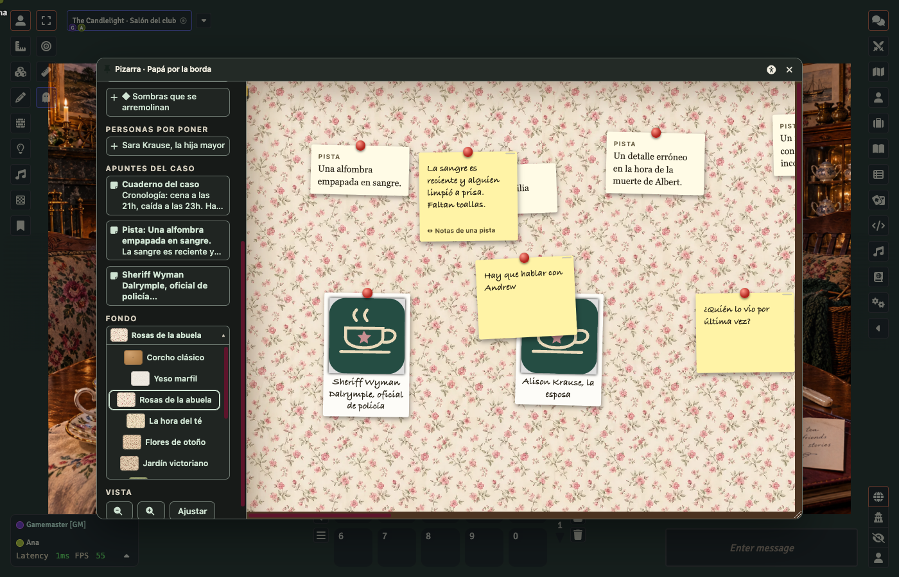

<p align="center">
  
</p>

<h1 align="center">Brindlewood Bay para Foundry VTT</h1>
<p align="center"><b>Hay té. Hay pastas. Y algo no encaja.</b><br>
El juego de misterios cozy-cósmicos de Jason Cordova, en español y con todas las reglas automatizadas.</p>

<p align="center">
  <a href="https://github.com/ManuRomera/brindlewood-bay-foundry/releases/latest"></a>
  <a href="https://foundryvtt.com"></a>
  <a href="https://github.com/ManuRomera/brindlewood-bay-foundry/releases"></a>
  <a href="LICENSE"></a>
</p>

<p align="center"><a href="https://manuromera.github.io/brindlewood-bay-foundry/"><b>Ver la página del proyecto</b></a> · <a href="CHANGELOG.md">Novedades</a> · <a href="docs/AUDITORIA.md">Auditoría contra el manual</a> · <a href="https://github.com/ManuRomera/brindlewood-bay-foundry/issues">Avisar de un fallo</a></p>

---

## Instalar en un minuto

En Foundry: **Game Systems → Install System** y pega este manifiesto:

```text
https://github.com/ManuRomera/brindlewood-bay-foundry/releases/latest/download/system.json
```

Crea un mundo con **Brindlewood Bay · El club de las Expertas**. Al entrar se abre el salón de **The Candlelight** y se crea su escena a pantalla completa. No necesita ningún módulo. Si ya lo tenías instalado, Foundry te ofrecerá la actualización en *Game Systems*.

## Qué te encuentras al abrirlo

<p align="center"></p>

**El salón del club** reúne en una ventana lo que el grupo necesita en la mesa: misterios activos con sus pistas, el progreso de cada Experta (PE, avances, Condiciones, Hogar y Coronas), la capa de la conspiración y el ritual de la sesión.

<table>
<tr>
<td width="50%"><br><b>Una ficha que cabe en media pantalla.</b> Cabecera fija con habilidades y límites; cinco pestañas: <i>En la mesa</i>, <i>Hogar y vida</i>, <i>Avance</i>, <i>Coronas</i> e <i>Historial</i>.</td>
<td width="50%"><br><b>Un cuaderno de investigación compartido.</b> Pistas, personas de interés con retrato y notas del grupo; la Guardiana revela y las jugadoras anotan.</td>
</tr>
<tr>
<td width="50%"><br><b>Tiradas sin sorpresas.</b> Eliges habilidad, objeto del Hogar y desventajas, y ves la fórmula exacta antes de lanzar.</td>
<td width="50%"><br><b>Cuatro perfiles visuales</b> y texto del 85 % al 160 %, a un clic desde la cabecera de cada ventana.</td>
</tr>
<tr>
<td colspan="2"><br><b>La pizarra de las detectives.</b> Pistas, retratos y notas sobre el corcho, unidos con hilos de colores. Los apuntes del tablero se pueden pasar a notas de la pizarra y devolverse. Todo el grupo la edita a la vez: quien arrastra una tarjeta la bloquea para los demás y se ve moverse en directo.</td>
</tr>
</table>

## Todo el manual, funcionando

| Regla del manual | Qué hace el sistema |
| --- | --- |
| 2d6 + habilidad, ventaja y desventaja | Fórmula automática; ventaja y desventaja se cancelan, nunca se acumulan |
| Los cuatro niveles de cada movimiento | La tarjeta del chat destaca el obtenido y pliega los otros tres |
| **Ponerse una Corona** | Botón en la propia tarjeta de un fallo: sube el nivel, marca la Corona, reescribe la tarjeta y deja la escena pendiente |
| Corona del Vacío | Se marca en orden; aplica Carruaje, Pepitas de granada y la retirada |
| Teorizar | 2d6 + pistas − complejidad, solo pistas ordinarias, con consenso; sin 12+ en el Misterio del Vacío |
| **Afable** | Quita la Condición y avisa de la Pista si es tu quehacer |
| Hogar, dulce hogar | 18 espacios, objetos que dan ventaja y se marcan, y los reutilizables de los movimientos expertos |
| PE y avances | Contador de 5, exceso pendiente, cinco avances únicos con tope +3 |
| 19 movimientos expertos | Usos por sesión, por misterio o únicos controlados; efectos automáticos de Dale Cooper, Fox Mulder, Frank Dowling, Frank Colombo, Colt Seavers, Thomas Magnum y más |
| Conspiración siniestra | Capas a 3 / 5 / 10 / 15 pistas (una menos con Fox Mulder) con **aviso privado** a la Guardiana al cruzar cada una |
| Inicio de sesión | Tarjeta con los movimientos que se resuelven al empezar (Dale Cooper, Jim Rockford, Espantapájaros) |
| Movimientos ocultistas | La Guardiana los define una vez y se entregan a todas las Expertas |
| **Pizarra de investigación** | Corcho compartido (u otros diez fondos: papeles pintados, yeso, maderas) con pistas, personas, notas y fotos unidas con hilos de colores; todas pueden moverlo a la vez sin pisarse |
| Pausa para anuncios | Indicio, regla del 10–11 y generador de guiones con más de un millón de combinaciones |

Seis misterios completos con sus expedientes privados, 49 personas de interés, los 19 movimientos expertos, los siete básicos y una guía rápida del sistema en el compendio de Reglas. Lo que el manual deja a criterio de la mesa (qué Condición afecta, qué consecuencia narrar) sigue en vuestras manos. Consulta la [matriz de automatizaciones](docs/REGLAS.md) y la [auditoría](docs/AUDITORIA.md).

## Pensado para jugar de verdad

- **Cada ventana recuerda** su posición, tamaño, pestaña, secciones plegadas y desplazamiento, y no pierde lo que estás escribiendo si otra persona provoca un repintado.
- **Retratos encuadrables** con zona y zoom, iguales en la ficha, el salón, el chat y el directorio.
- **Accesibilidad por ventana:** el icono de la cabecera abre perfiles Estándar, Oscuro mate, Alto contraste AAA y Ámbar; tamaño de texto, tipografía de alta legibilidad, movimiento reducido, foco de teclado reforzado y ayuda inmediata.
- **Las jugadoras se crean su Experta** sin permisos de Actor: la Guardiana conectada valida y entrega la propiedad. Asistente paso a paso o Experta al azar, con opción de castellanizar nombres y objetos.
- **Visibilidad del chat respetada** (pública, solo Guardiana, ciega).
- Compatible con Foundry **13** (verificado en 13.351) y con la capa de compatibilidad para **14**.

## Para quien quiera mirar dentro

DataModels, ApplicationV2 y compendios generados desde JSON legible (`_data/`) con `npm run build`. `npm test` ejecuta 61 pruebas de reglas, contenido y formularios; `npm run check` valida manifiesto, versiones y recursos. Cada versión se publica al subir una etiqueta `vX.Y.Z`.

## Créditos y aviso

*Brindlewood Bay* es obra de **Jason Cordova** (The Gauntlet); la edición española es de **Chus Abascal** y compañía, con arte de Cecilia Ferri y Daniel Jimbert. Este es un proyecto de aficionado, sin afiliación con los autores ni los editores. Adaptación a Foundry VTT: **[Manu Romera](https://github.com/ManuRomera) · Digital RPG Design**. Código bajo licencia MIT; los textos del juego pertenecen a sus autores.
