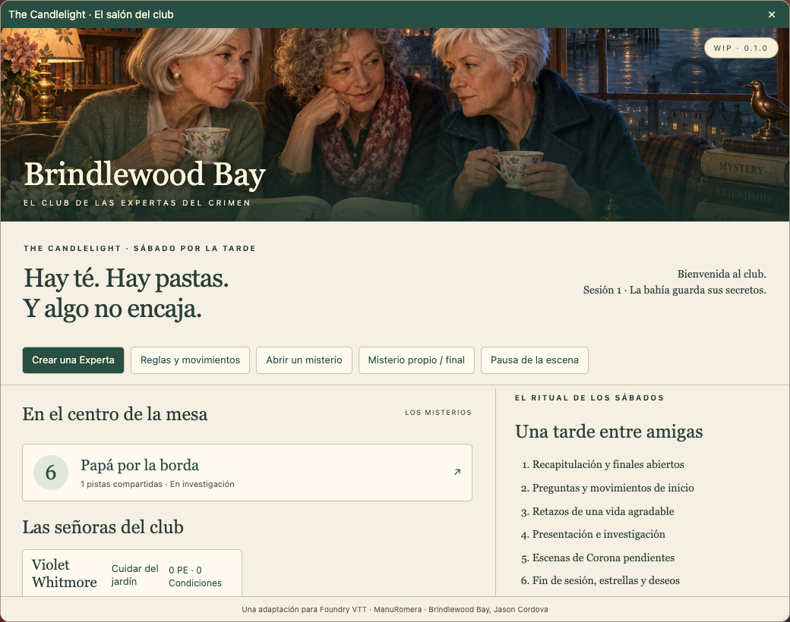
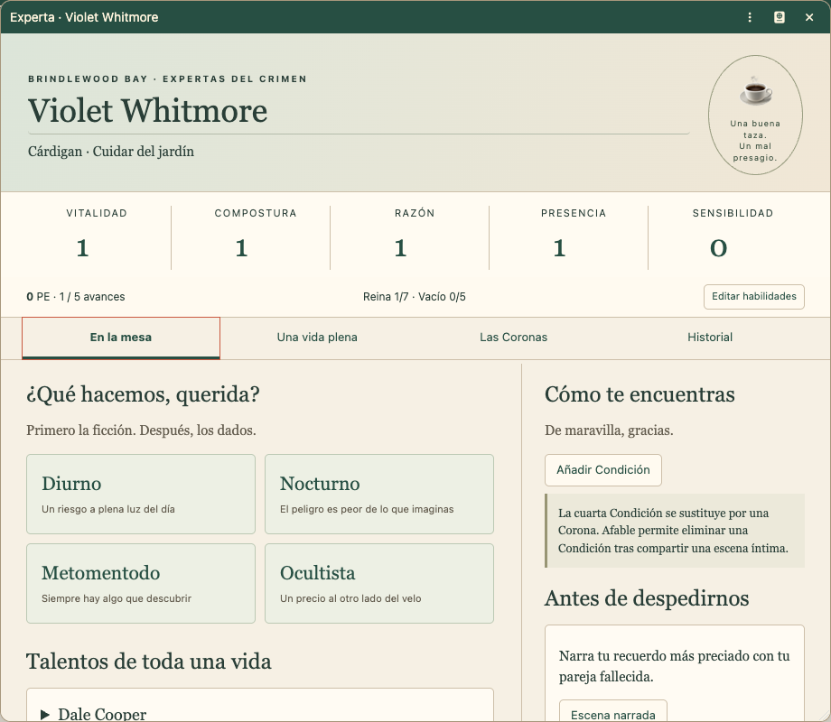
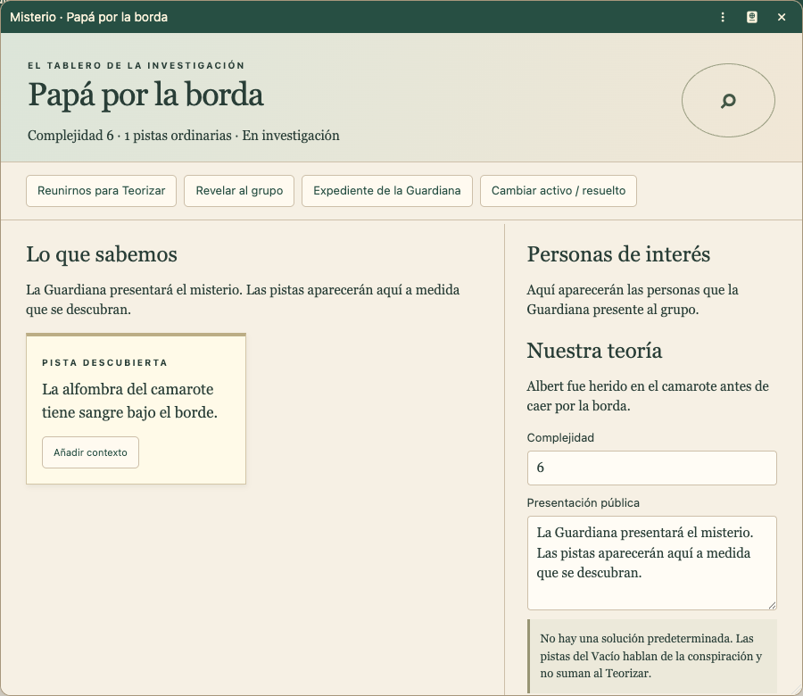

# Verificación de la WIP 0.6.1-wip.1

Fecha: 16 de septiembre de 2026. Foundry 13.351 real, servidor local con directorio de datos aislado y Chromium de escritorio. Ningún mundo del usuario se usó como prueba. Código dirigido a Foundry 13; no se declara verificada la versión 14.

## Pruebas automatizadas

42 pruebas de contenido, fórmulas, umbrales de resultados, Coronas, avances, límites de recursos, exclusividades, validación de creación, escena y libros de casos, instalación de macros, catalogación, posiciones de ventanas, variedad y redacción de anuncios, progresión de la conspiración y conservación de campos de formulario. Validador de manifiesto, versiones, sintaxis y recursos; construcción de ocho compendios LevelDB y ZIP.

## Pruebas realizadas dentro de Foundry

- Crear y lanzar un mundo con el sistema; cargar los ocho compendios sin errores de esquema.
- Abrir los seis expedientes: 31 páginas de aventura con contenido, incluidas todas las secciones de preparación.
- Recorrer el nuevo asistente de cinco pasos: identidad, reparto fijo de habilidades, aumento de +1, movimiento experto con texto completo, vida anterior, entre 3 y 5 objetos del Hogar y dos preguntas de fin de sesión.
- Crear Violet Whitmore desde el asistente con Dale Cooper: reparto inicial correcto y aumento de Sensibilidad aplicado.
- Generar y revisar una Experta completa con «Castellanizar»: Consuelo Sáez, afición, estilo, familia, carrera y Hogar españoles; Razón aumentada y efecto automático de Michael Knight aplicado.
- Abrir y cambiar entre las cuatro secciones de la ficha; los controles nativos de ventana y sus iconos funcionan.
- Añadir un objeto del hogar, usarlo en Metomentodo, obtener una reserva `3d6kh2 + 1` y comprobar que queda marcado y conservado.
- Tirar Diurno, aplicar una Corona a un resultado fallido y conservar dados originales, nuevo nivel y escena pendiente.
- Comprar Jonathan Hart con 5 PE: PE a cero, aumento de Presencia y ambos movimientos conservados.
- Editar la descripción de Dale Cooper y comprobar que fuente, clave, frecuencia, automatización y uso permanecen intactos. Restaurar después el texto original.
- Abrir Papá por la borda, revelar una pista con contexto y comprobar que el Actor público contiene únicamente lo revelado.
- Teorizar como Guardiana: pista seleccionada y fórmula `2d6 + 1 - 6`; sin modificadores ordinarios.
- Entrar desde una segunda sesión como jugadora propietaria de la Experta. El salón no muestra los controles de Guardiana ni las capas secretas; el tablero público permite Teorizar aunque sea de solo lectura.
- Resolver una escena de Corona y cerrar la sesión con una respuesta afirmativa: +1 PE. El segundo cierre se rechaza y no vuelve a conceder experiencia.
- Crear un diario privado de trabajo al abrir el expediente. El original de compendio permanece separado de las notas de campaña.
- Abrir Nocturno sin escribir ningún texto: el primer diálogo permite preparar la mecánica y una segunda advertencia ofrece «Continuar» o «Volver» antes de lanzar.
- Comprobar una tirada nocturna en el chat: resultado activo, cuatro grados completos, habilidad, modificador y dados originales visibles.
- Abrir información de Diurno con botón derecho, anclarla, abrir otro documento y confirmar que permanece; el aspa, la desactivación de la chincheta y el clic exterior respetan sus estados.
- Abrir el selector de imagen desde el retrato de una Experta y comprobar la ruta actual y la posibilidad de elegir o subir archivos permitidos.
- Migrar el mundo de prueba desde 0.2.0 a 0.3.0 sin errores de esquema y abrir las fichas existentes.
- Comprobar en el salón el contador de misterios activos y, en la ficha, los límites visibles de 18 objetos, 3 Condiciones, 5 PE, 5 avances, 7 Coronas de la Reina y 5 del Vacío.
- Comprobar que los controles de avance se desactivan antes de reunir 5 PE y que cada movimiento experto muestra su frecuencia y estado de uso.
- Comprobar como Guardiana y como jugadora que el salón muestra los mismos contadores comunes, las pistas desplegables de cada caso y el progreso esencial de las Expertas; las acciones de administración solo aparecen para la Guardiana.
- Abrir la ficha rediseñada y comprobar que habilidades, PE, avances, Condiciones, Hogar y Coronas permanecen visibles mientras se consultan los movimientos. Los contadores compactos dejan más espacio útil. Moverla, cerrarla y abrirla de nuevo confirma que recupera la última posición dentro del área visible.
- Crear automáticamente la escena «The Candlelight · Salón del club», comprobar el encuadre completo, la ausencia de cuadrícula, visión y niebla, el salón sin personajes y el título legible sobre el libro central. Tras resolver «Papá por la borda» y abrir «Un grito en Halloween», la pila muestra el caso resuelto y el caso activo sin tapar el libro central.
- Dar paso a anuncios desde el salón como Guardiana y publicar únicamente el indicio y la regla del resultado 10–11. Entrar como jugadora y pulsar la macro «Generador de anuncios»: abre directamente una propuesta privada redactada y «Generar otra propuesta» la sustituye sin publicar nada en el chat.
- Entrar como jugadora sin el permiso general «Crear Actores» y comprobar que el directorio muestra «Crear mi Experta» bajo «El salón del club». Abrirlo y verificar que ofrece creación guiada y aleatoria.
- Mantener conectadas a la Guardiana y a la jugadora en dos sesiones. Crear al azar y castellanizar a Rosario Gallardo desde la sesión jugadora; la Guardiana valida la petición, se crea «PJ: Rosario Gallardo» con propiedad exclusiva de esa jugadora, aparece en el salón y la ficha editable se abre en su sesión.
- Comprobar que los Actores existentes y nuevos aparecen catalogados como «PJ: …» y «Caso: …», sin repetir el prefijo al recargar el mundo.
- Comprobar desde la sesión jugadora que «Generador de anuncios» aparece en el directorio de macros y en la posición 1 de la barra, con su icono propio, y que abre el generador privado completo.
- Abrir el creador guiado como jugadora: el paso de identidad conserva visibles todas las sugerencias aunque haya un estilo seleccionado, enumera en la propia ventana los datos que faltan, mantiene desactivado «Asignar habilidades» y «Cancelar» cierra el proceso sin crear documentos ni producir errores.
- Abrir la confirmación de reinicio y comprobar que enumera el alcance y la conservación de los compendios. La selección de documentos y el reajuste de estado se revisaron mediante las pruebas de construcción; no se ejecutó la eliminación final sobre datos del usuario.

## Errores encontrados y corregidos durante la prueba

1. `tab` es una acción reservada de ApplicationV2. Las pestañas propias emplean `switchTab`.
2. Foundry desactiva botones en documentos de solo lectura. Se habilita exclusivamente Teorizar para observadoras del misterio; no los controles de edición o revelación.
3. Los estilos generales de botones alteraban los iconos nativos y el tamaño del título de ventana. Se separaron sus reglas visuales.
4. El valor original de los dados podía confundirse con el nivel revisado de Corona. La tarjeta muestra el nivel efectivo y conserva los dados en un desplegable identificado.
5. El selector de imagen y el evento de renderizado de chat tenían alias heredados. Se sustituyeron por las API con espacio de nombres de Foundry 13.
6. El primer archivo de dependencias contenía enlaces a otro proyecto local. La verificación pública instala las tres versiones fijadas desde el registro y deja de depender de rutas del equipo de desarrollo.
7. La macro de compendio no declaraba autor. Foundry permitía abrirla y ejecutarla, pero emitía una advertencia de validación; ahora declara explícitamente autor nulo.
8. El intercambio de creación entre jugadora y Guardiana requería declarar el canal de socket en el manifiesto. La primera prueba real agotó el tiempo de espera; se añadió `socket: true`, se reinició el mundo y la prueba completa terminó con la ficha creada y abierta para su propietaria.

## Alcance de los permisos

Las notas de campaña se guardan en diarios con propiedad por defecto 0. El Actor público no contiene la lista de pistas aún no descubiertas ni las biografías secretas de los sospechosos. Los compendios de Guardiana están ocultos del directorio de las jugadoras.

Ocultar un compendio no es un mecanismo contra la inspección técnica: la API de Foundry 13 permite recuperar los documentos del compendio y el contenido publicado en GitHub también es público. Esta adaptación protege la presentación normal y las notas de campaña mediante documentos separados; no promete ocultar el material publicado a quien lo busque deliberadamente.

## Pendiente antes de una versión estable

- Partida completa de campaña y prueba exhaustiva de las 19 habilidades con sus decisiones narrativas.
- Pruebas con Dice So Nice y combinaciones de módulos de terceros.
- Pruebas de interrupción de red durante cada operación y edición simultánea de una misma Experta por varios propietarios. La cola actual serializa acciones en un cliente, no constituye una transacción distribuida.
- Navegadores móviles, lector de pantalla y una auditoría formal de accesibilidad. Se revisaron contraste y controles visibles; no se declara certificación WCAG.
- Foundry 14 y generaciones posteriores.

Las capturas siguientes pertenecen al mundo de prueba real:

## Corrección visual de libros 0.5.1

Previsualización en navegador con los seis libros simultáneos y las dimensiones exactas de la escena. Todos los lomos conservan su título visible; el libro central queda libre. Dos pruebas adicionales verifican el espacio reservado, proporciones, escala, migración de baldosas existentes, recuentos de 0, 1, 2 y 6 casos y conservación de decoraciones ajenas. Esta corrección se ha comprobado en composición de navegador y pruebas del sincronizador; no se ha repetido una sesión completa en Foundry.
